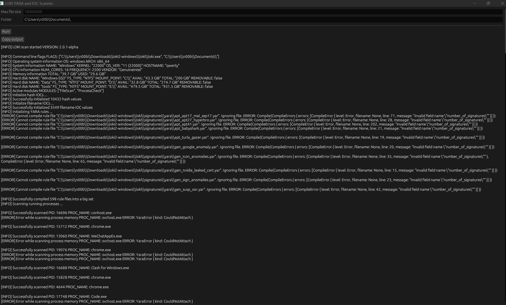

# LOKI2-gui
LOKI - Simple IOC and YARA Scanner ( gui version )   
Fork from [loki2](https://github.com/Neo23x0/Loki2)  


## Status
__*Do not use in ur project , this project is for learning*__  
__*Do not use in ur project , this project is for learning*__  
__*Do not use in ur project , this project is for learning*__  
__*Do not use in ur project , this project is for learning*__  
Work in Progress. This version is not ready for use. There's still some work to do for a first release. 


### What's already implemented

- System reconnaissance (system and hardware information for the log)
- Logging and formatting of the different log outputs
- File system walk
- File time evaluation (MAC timestamps)
- Exclusions based on file characteristics
- IOC initialization - hash values
- IOC matching on files (hashes)
- YARA rule initialization, syntax checks, and error handling
- YARA scanning of files
- YARA scanning of process memory 

### What's still to do

- IOC initialization - file patterns
- IOC initialization - C2 patterns (FQDN, IP)
- IOC matching on files (file patterns)
- C2 IOC matching (process connections)
- File system walk exceptions: network drivers, mounted drives etc.
- Custom exclusions (regex on file path)
- Release workflows (automatically build and provide as release)

# Setup Build Environment

## Requirements

I only test for windows 10 / windows 11

- Windows

## Providing Signatures 

only work for `yara 3.11`

## Build

```bash
cargo build --release 
```


## Usage

```
./loki-gui.exe
```

# Screenshots

LOKI 2 (gui) alpha version


